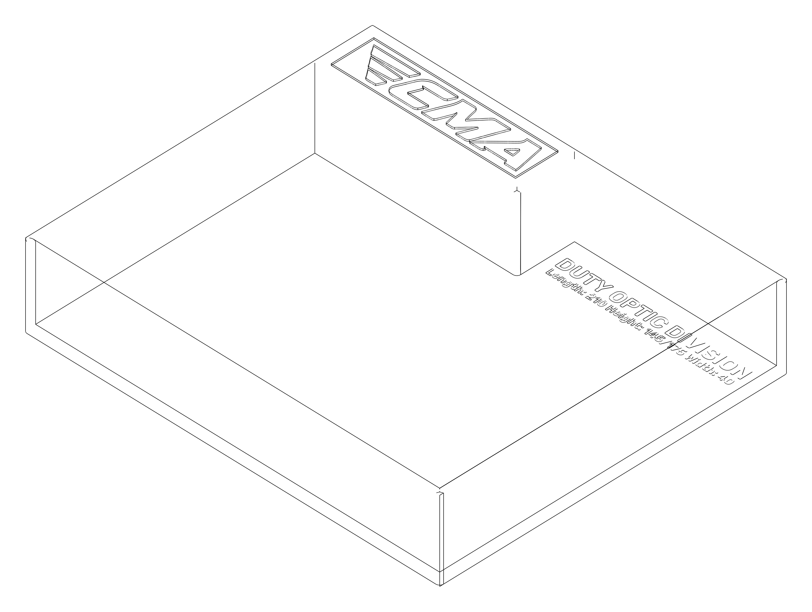

# The Box

A simple **3d-printable** box for assessing whether the **CMA** participant's equipment satisfies the dimensionality requirements of the desired category.

- This repository contains the openscad files, the assets and build scripts.
- You can download the print-ready `.stl` files from the [CMA website](https://example.com).

## Dimensions

Inner dimensions of the box (nominal values, as printed on the labels).
The modeled cavity adds +0.4 mm to every inner dimension (nozzle-width
print clearance), so the printed cavity ends up at least the nominal
size.

### Duty Division (insert installed)

- **Length**: 210 mm
- **Height**: 145 mm
- **Width**: 40 mm

### Duty Optics Division (insert removed)

- **Length**: 210 mm
- **Height**:
  - First half along length: 145 mm
  - Second half along length: 175 mm (optic pocket)
- **Width**: 40 mm

## Design

- Edges, rims, and outer corners are rounded.
- +0.40 mm (one 0.4 mm nozzle width) is added to every nominal inner dimension.
- Wall and floor strength is 3.2mm.
- The final outer dimensions are 216.8 x 181.8 x 43.6 mm

## Printing Notes

- The box and the insert can be printed on a 220x220 bed at the same time (tight fit).
- This is a large part, make sure the bed is level and calibrate before printing.
- We used default settings (15% infill) for all test prints using CR-PLA with a Creality K1C.
- Print takes approximately 8 hours depending on settings and whether the insert is printed alongside the box. One set takes around 230g of PLA (@15% infill), therefore four sets can be printed from a standard 1kg spool.
  - **Box**: 191g of PLA and 6h 45min printing time.
  - **Insert**: 38g of PLA and 1h 15min.
  
## Project Structure and Build Notes

Tested and rendered with `OpenSCAD version 2026.10.03` (any OpenSCAD AppImage
dropped into `bin/` works — `build.sh` picks up `bin/OpenSCAD-*.AppImage`,
git-ignored; binary STL export via `--export-format binstl`) on Ubuntu
2024.04; also verified with `OpenSCAD version 2021.01` (CGAL, same
dimensions - `build.sh` falls back to it when no AppImage is present).

Two design files:

- `openscad/duty_division.scad`: the box
- `openscad/duty_division_insert.scad`: the labeled insert

Three utility scripts:

- `assets/font/create_label_svgs.py`: Regenerate after changing a label string
  (needs Rubik-SemiBold.ttf from the font, not shipped here - see the script's
  error for where it looks):
  `uv run --with fonttools python3 assets/font/create_label_svgs.py`
- `assets/logo/trace_logo.sh`: regenerates the SVG from the AVIF
  (ImageMagick + `uvx vtracer`)
- `assets/render/make_lineart.py`: vector line-art renders for the README
  (black/white outlines from the STLs, hidden-line removed); writes
  PNG + SVG into `assets/render/preview/`:
  `uv run --with numpy --with matplotlib python3 assets/render/make_lineart.py`

One build script:

- `build.sh`

## Acknowledgements

Development of this project was sponsored and carried out by [WWB AG](https://wwb.swiss) for CMA.

## Licenses

- Code build and preprocess scripts: Creative Commons Attribution 4.0 International
- Assets:
  - Logo: CMA proprietary 
  - Font: OFL (`OFL.txt`)
  